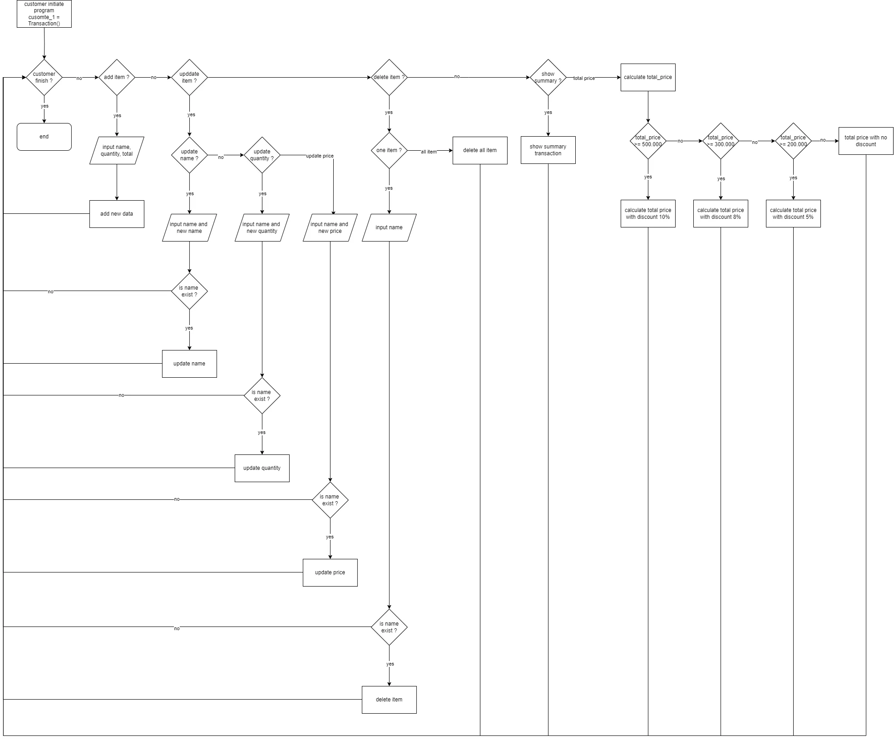

# Self Service Cashier

## Background
Andi wants to implement a cashier system in his supermarket so that his customers can engage in self-service. The Customers can add their own item consisting of name, quantity and price, update the item and delete one or all of the item. After the customer happy with their transaction, they can see their total price and whether they get discount or not.

## Flow Chart


## Feature Requirements

- User can add a new item
```python
# user can add a new item by implementing add_item method
add_item(name, quantity, price)
```
- update_item()
```python
# user can update an existing item
# user can update item name by implementing update_item_name
update_item_name(name, new_name)
# user can update item quantity by implementing update_item_qty
update_item_qty(name, new_quantity)
# user can update item price by implementing update_item_price
update_item_price(name, new_price)
```
- delete_item()
```python
# user can delete an existing item by implementing delete_item method
delete_item(name)
```
- reset_transaction()
```python
# user can delete all existing item by implementing reset_transaction method
reset_transaction()
```
- check_order()
```python
# user can review their transaction by implementing check_order method
check_order()
```
- total_price()
```python
# user can see total price of their transaction by implementing total_price method
# if total price is greater and equal to 500.000, they will get 10% discount
# if total price is greater and equal to 300.000, they will get 8% discount
# if total price is greater and equal to 200.000, they will get 5% discount
total_price()
```

all this requirement will be inside Transaction class. Each user will call Transaction class
```python
class Transaction:
    pass

customer_1 = Transaction()
```

## How To Run

### Requirement

- python
- tabulate

### Test Case

to test the test case run `test_case.py`. It will import the `Transaction` class from `cashier.py` and run sample case.

### Interactive Cashier

to simulate interactive cashier without manually add test case run `python interactive_cashier.py`.

## Future Request

create simple form UI to implement all methond from `Transaction` class.